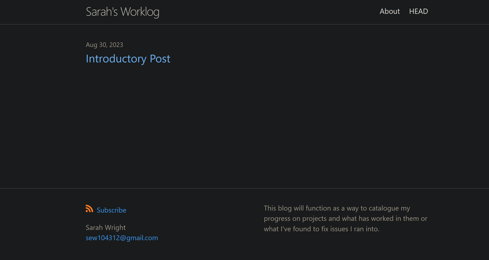
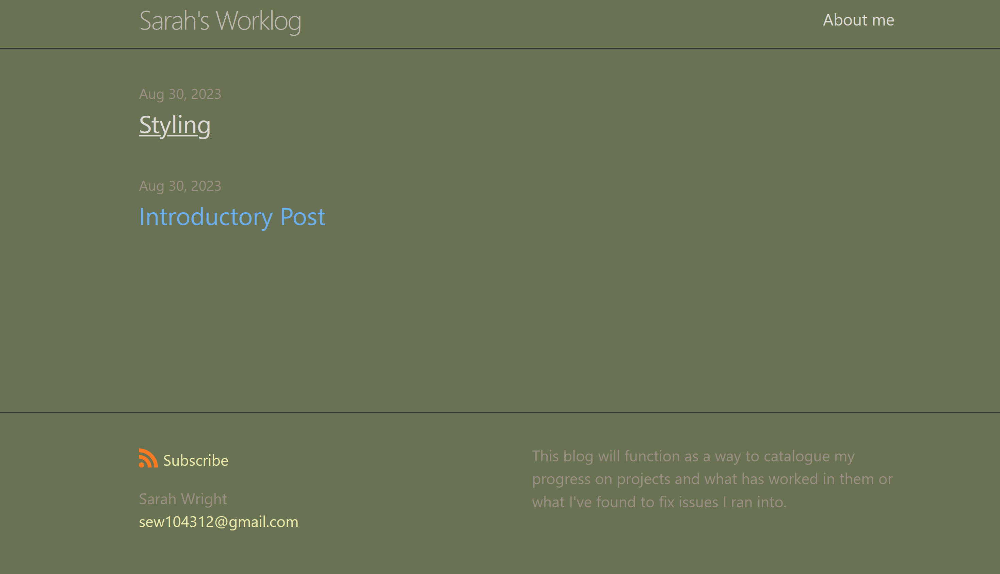

With this post, it marks that I've made a few changes to the styling of my blog. The three changes I made are all pretty simple but make a nice impact on the look of the blog. I changed the background color to a simple sage green, changed the hyper-link color to a sand like color and changed the font of the post headings. I definitely had an interesting time doing this as I ran into an odd error.

 

The weird error that I ran into was one with no actual solution and turned out to have no fix beyond just ignoring it. I assume its due to something with VScode which is what I use to interface with the website creation. Although I was slightly annoyed by there being no real solution to the error, because of it I had the chance to look at a lot of documentation related to Sass; most notably the syntax specific section [here](https://sass-lang.com/documentation/syntax/) and the overall documentation listed [here](https://sass-lang.com/documentation/).

Through my perusal of the documentation trying to figure out that wild error, I found the [import section](https://sass-lang.com/documentation/at-rules/import/) which was useful later when I imported a font to use on the hyper-links. 

Images also caused quite the problem for me as no matter where I put them/where I called them from in the pathing I could only get the alt text to show up. Due to the many forums I went through on this issue, I even checked to make sure the local pathing of the html that the markdown was translated into was correct. All to no avail. The images had defeated me at least for the night.
